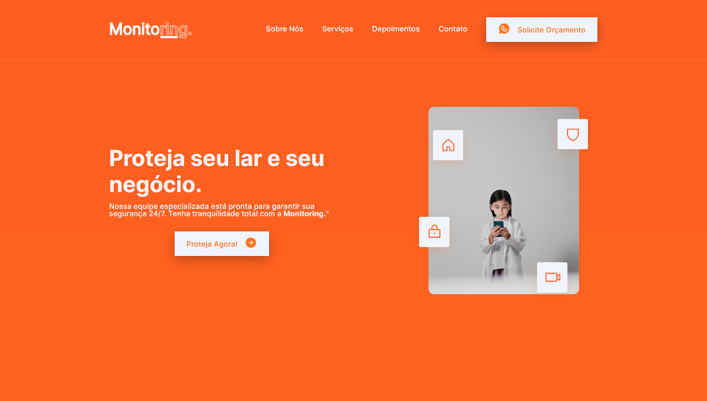

# Monitorint Landing-Page

O projeto "Monitoring" é uma landing page desenvolvida com HTML, CSS e JavaScript, criada com o objetivo de aperfeiçoar minhas habilidades front-end. Essa página foi projetada para uma empresa fictícia de monitoramento de casas e empresas, oferecendo uma solução abrangente de segurança e proteção.

Com um design moderno e responsivo, a landing page destaca a importância da segurança por meio de um título impactante. Ela apresenta seções informativas sobre os serviços oferecidos pela empresa, detalhes sobre a empresa e um formulário de contato para solicitar um orçamento.

O projeto visa demonstrar minha capacidade de criar uma experiência de usuário envolvente, combinando elementos visuais atrativos com funcionalidades interativas. Foram aplicados princípios de design responsivo para garantir que a página seja acessível e se adapte a diferentes dispositivos, proporcionando uma experiência consistente em desktops, tablets e smartphones.

## 🚀 Tecnologias utilizadas

- HTML e CSS
- JavaScript
- ScrollReveal
- Git e Github

[💻 Live Preview](https://monito-ring.netlify.app/)

## 🛠️ Melhorias Futuras

- [ ] Criar mais elementos de informações.
- [ ] Adicionar recursos de localização e mapas.
- [ ] Incorporar chat ao vivo.

---
Made with 🧡 by [Eriralf Barros.](https://www.linkedin.com/in/eriralfbarros/)